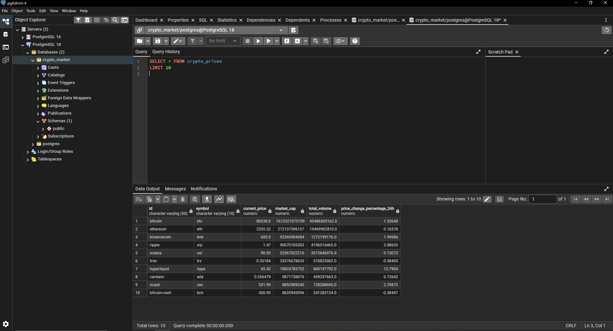
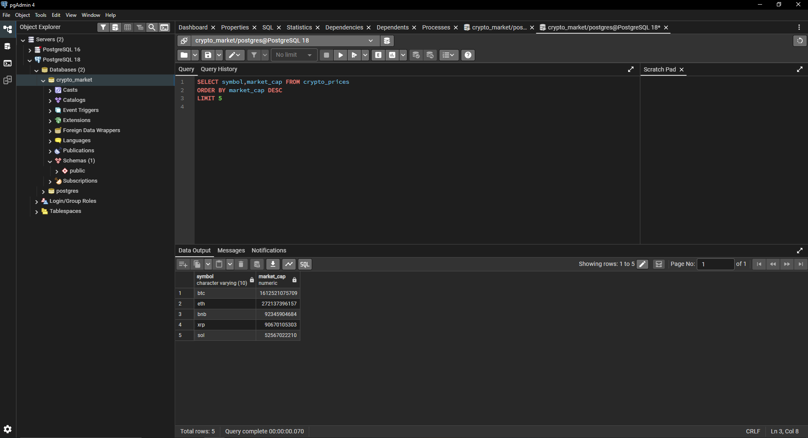
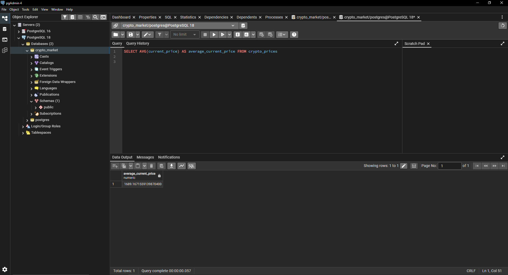
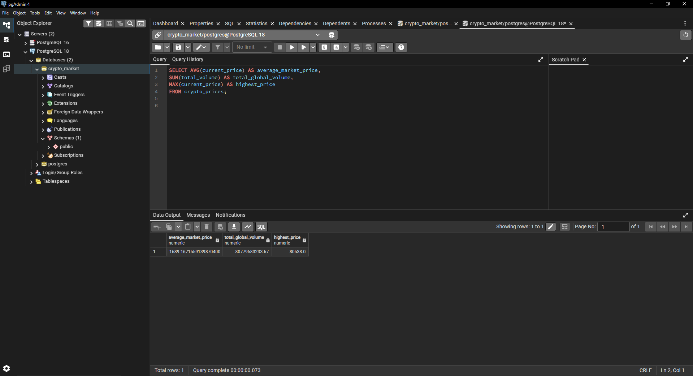
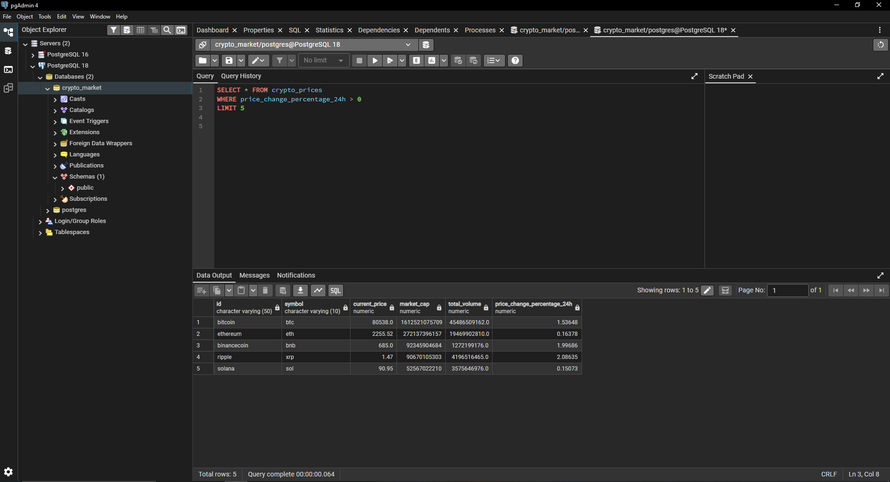
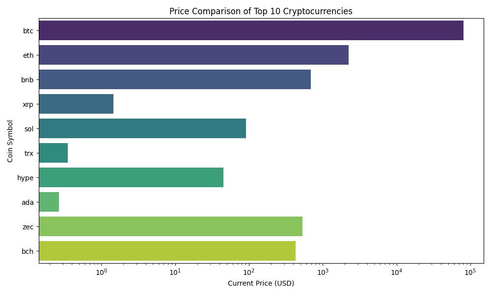
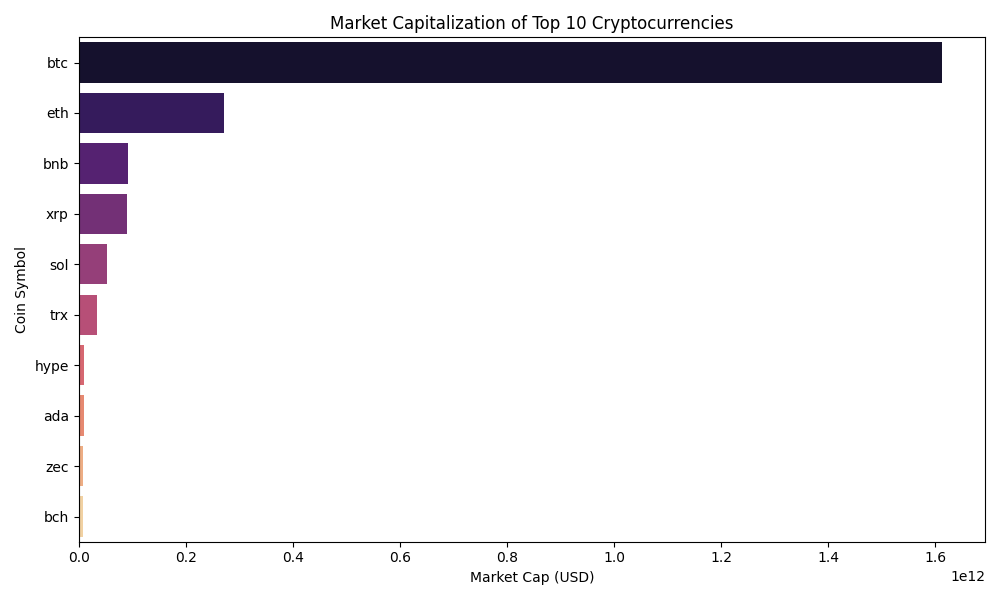
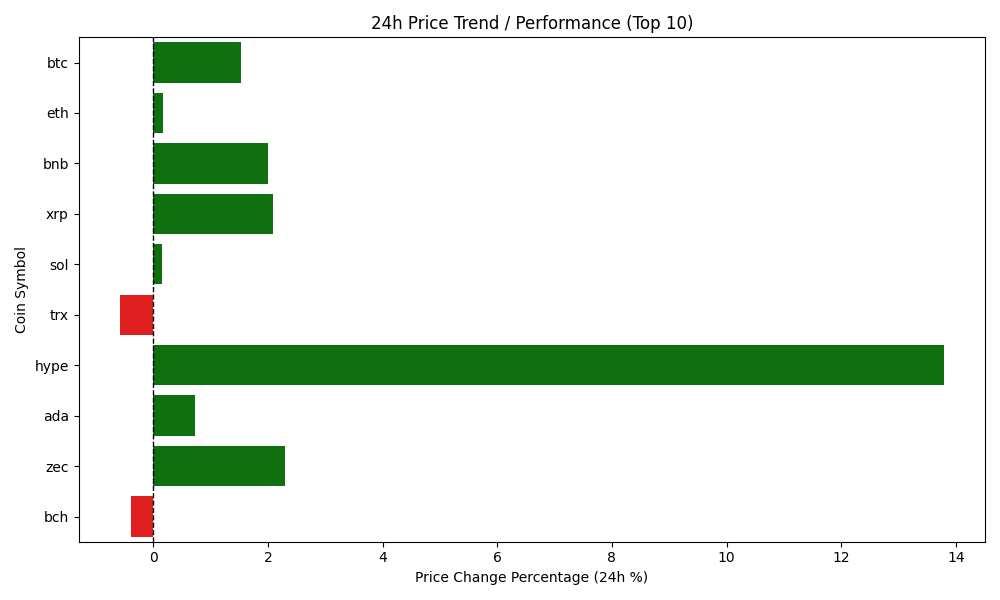

# Crypto Market Analysis

## Project Overview
This project retrieves real-time cryptocurrency market data from the CoinGecko API, processes the data using Python and Pandas, stores it in SQL, and performs data analysis with SQL queries and visualizations.

---

## Technologies Used
- Python
- Pandas
- Matplotlib
- Seaborn
- SQL
- CoinGecko API

---

## Features
- Retrieve live cryptocurrency market data using API requests
- Transform JSON data into structured tabular format
- Store and query data using SQL
- Analyze cryptocurrency metrics using SQL queries
- Visualize market trends and comparisons with charts

---

 ## Key Insights

- Bitcoin had the highest market capitalization
- Ethereum showed stable trading volume
- Solana presented higher short-term volatility

---

## Data Exploration & Insights (SQL Queries)

1. Database Table Verification
```sql
SELECT * FROM crypto_prices 
LIMIT 10;
```


2. Market Leaderboard (Top 5 Coins by Market Cap)
```sql
SELECT symbol, market_cap FROM crypto_prices
ORDER BY market_cap DESC
LIMIT 5;
```


3. Average Asset Price
```sql
SELECT AVG(current_price) AS average_current_price 
FROM crypto_prices;
```


4. Global Market Aggregations
```sql
SELECT 
    AVG(current_price) AS average_market_price,
    SUM(total_volume) AS total_global_volume,
    MAX(current_price) AS highest_price
FROM crypto_prices;
```


5. Short-Term Performance View
```sql
SELECT * FROM crypto_prices
WHERE price_change_percentage_24h > 0
LIMIT 5;
```



Modular Data Visualizations (Python OOP)
By running the pipeline, the object-oriented package pulls directly from the relational database driver (psycopg2) to convert row-data into charts.

1. Price Comparison (PriceVisualizer)
Plots nominal asset value tracking. Utilizes log-scaling adjustments so that top-tier assets and sub-dollar altcoins are structurally comparable on a single view:


3. Capitalization Weight (MarketVisualizer)
Visualizes the vast capital distribution gaps among the top 10 market leaders:


5. 24h Momentum and Market Trend (TrendVisualizer)
Generates short-term market sentiment indicators, dynamically mapping gains in green and losses/retracements in red:


Requirements & Tech Stack
- Python 3.x

- PostgreSQL & pgAdmin 4

- Libraries: pandas, requests, matplotlib, seaborn, psycopg2-binary

How to Run
-- Ensure your PostgreSQL server is running and the credentials in main.py are correct.

-- Open your terminal inside the project directory and install the dependencies:

  Bash
   pip install pandas requests matplotlib seaborn psycopg2-binary
   
  Run the primary analytical workflow pipeline:
   Bash
   python main.py
